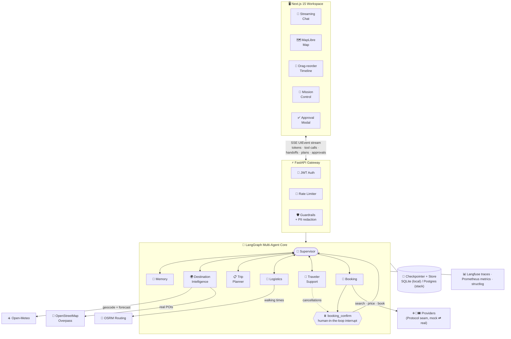
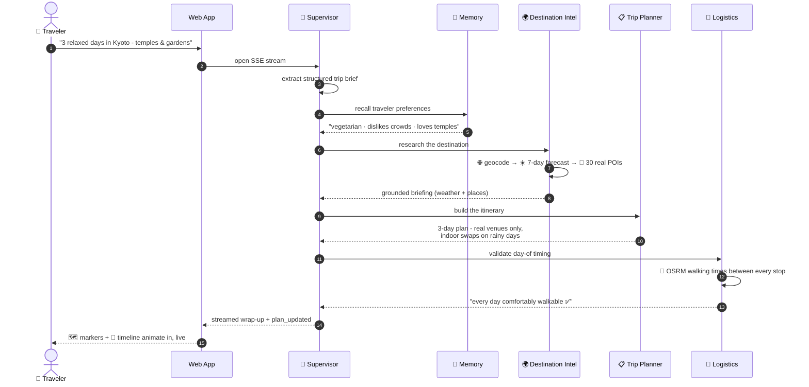
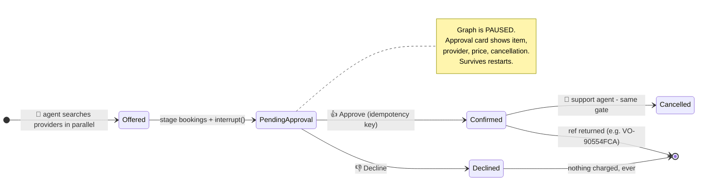
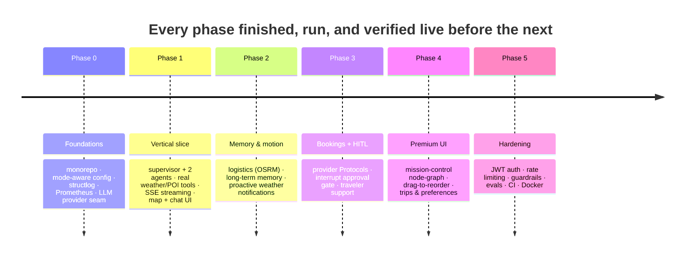

<div align="center">

# 🧭 Odyssey

### A team of AI agents that plans your trip — live, grounded, and under your control

*Describe a trip in plain English. Watch seven specialized agents research it, plan it, price it, and lay it out on a live map — with every handoff, tool call, and decision visible in real time.*

<br/>

### [🌍 Try the live demo →](https://yuvraj0208.github.io/Odyssey-Multi-Agent-Travel-Platform/app/)

[](https://yuvraj0208.github.io/Odyssey-Multi-Agent-Travel-Platform/app/)
[](https://odyssey-api-z161.onrender.com/docs)
[](https://github.com/Yuvraj0208/Odyssey-Multi-Agent-Travel-Platform/actions/workflows/ci.yml)


**100% open-source stack · real open data · no proprietary SaaS · runs locally**

</div>

---

## ✨ Why Odyssey is different

| | Feature | What makes it real |
|---|---|---|
| 📡 | **Live Mission Control** | The multi-agent system is *visible*: an animated node-graph where agents light up as they work, handoffs travel along the edges with their reasons, and tool calls stream in with args and results. Not a debug dump — a stage-demo feature. |
| 🌍 | **Grounded in real data** | Weather from Open-Meteo, points of interest from OpenStreetMap, walking times from OSRM. The planner can only place venues that exist — **geo-coordinates are attached deterministically from real POI results, so nothing is hallucinated onto the map.** |
| ✋ | **Human-in-the-loop bookings** | Built on LangGraph `interrupt()` — the graph *pauses* mid-execution, an approval card shows exactly what will be booked, and **nothing is ever confirmed without your explicit click**. Idempotency keys mean a retry can never double-book. |
| 🔁 | **Durable, resumable sessions** | Conversations are checkpointed. Close the tab, restart the server, come back — the full transcript, itinerary, map, and even a *pending approval* are restored exactly where you left off. |
| 🧠 | **Long-term memory** | "Vegetarian, hates crowds, loves temples" — remembered across sessions, recalled at the start of planning, and used to personalize every future trip. Editable in the UI. |
| ⛈️ | **Proactive re-planning** | An event-driven monitor re-checks live weather against your outdoor plans and pushes a notification with a **one-click "ask agents to fix it"** — event bus, not polling. |
| 🖱️ | **Drag-to-reorder timeline** | Drag a stop to a new slot and the Logistics agent re-validates real walking times between every stop, instantly and deterministically (no LLM call, no token cost). |

---

## 🏗️ Architecture



**Loose coupling is the design center.** Every agent lives in its own module and self-registers in `AGENT_REGISTRY`; the supervisor's routing is assembled from the registry at runtime. Adding an agent = write one module, call `register(...)`. Zero edits to the supervisor or peers.

---

## 🎬 Anatomy of a planning turn

What actually happens when you type *"Plan a relaxed 3-day trip to Kyoto — I love temples and gardens"*:



Every arrow above is streamed to the browser as it happens — that's what the Mission Control panel renders.

---

## 🎫 The booking gate: nothing without your yes



The mock providers are deliberately realistic: latency, occasional failures, **price changes on re-quote, limited inventory behind a lock, and idempotent booking** — so the degradation and approval paths are genuinely exercised. A real provider (e.g. Amadeus sandbox) slots in behind the same `Protocol` with zero agent changes.

---

## 🤖 The team

| Agent | Role | Superpower |
|---|---|---|
| 🧭 **Supervisor** | Orchestrator | Deterministic forward pipeline + LLM judgment at the decision point — guaranteed termination, no skipped steps, and smart follow-up routing ("swap the rainy day" → planner) |
| 💾 **Memory** | Personalization | Recalls durable preferences before planning; salient facts written back at end-of-turn |
| 🌍 **Destination Intelligence** | Research | ReAct tool-calling loop: geocoding, live forecasts, real POIs matched to your interests |
| 📋 **Trip Planner** | Synthesis | Structured itineraries with geo attached only from verified places; weather-aware scheduling |
| 👟 **Logistics** | Feasibility | Real OSRM walking times, transit annotations, over-packed-day warnings |
| 🎫 **Booking** | Transactions | Parallel provider search, staging, and the interrupt-gated confirm with idempotency |
| 🛟 **Traveler Support** | Concierge | Trip-grounded Q&A; cancellations routed through the same approval gate |

---

## 📅 Built in six verified phases



---

## 🚀 Quick start

### Local mode — no Docker needed

```bash
# 1. Backend
cd apps/api
python -m venv .venv && . .venv/Scripts/activate      # macOS/Linux: bin/activate
pip install -e ".[dev,local,llm,auth]"
cp ../../.env.example ../../.env                       # add your GROQ_API_KEY (free: console.groq.com)
python -m odyssey.db.seed                              # 6k airports + knowledge (optional)
ODYSSEY_MODE=local uvicorn odyssey.main:app --reload --port 8000

# 2. Frontend (second terminal)
cd apps/web && npm install && npm run dev              # → http://localhost:3000
```

### Full stack — one command

```bash
cp .env.example .env    # set GROQ_API_KEY
docker compose up --build
# web :3000 · api :8000 · langfuse :3001 · postgres · redis · qdrant
```

| | `local` mode | `stack` mode |
|---|---|---|
| Checkpointer / store | SQLite (persists) / in-process | Postgres |
| Vectors | Chroma | Qdrant |
| Pub/sub | in-process | Redis |
| Tracing | optional | Langfuse |

Endpoints: `/health` · `/ready` · `/metrics` (Prometheus) · `/docs` (OpenAPI)

### Swap the LLM with one env var

```bash
ODYSSEY_LLM_PROVIDER=groq    ODYSSEY_LLM_MODEL=llama-3.3-70b-versatile   # default (free tier)
ODYSSEY_LLM_PROVIDER=ollama  ODYSSEY_LLM_MODEL=qwen2.5:7b                # local open weights
ODYSSEY_LLM_PROVIDER=openai  OPENAI_BASE_URL=... OPENAI_API_KEY=...      # vLLM / TGI / OpenRouter
```

> ⚠️ Groq's free tier is rate-limited (~100k tokens/day on the 70B). For sustained use, point `openai` at any served endpoint.

---

## 🔬 Quality bar

```
✔ 37 backend tests        schemas · planner mapping · routing · providers ·
                          idempotency · inventory · security · guardrails · evals
✔ ruff clean              lint + import order
✔ tsc --noEmit clean      strict TypeScript
✔ GitHub Actions CI       ruff · pyright · pytest · tsc · next build · docker build
✔ Eval harness            deterministic checks (budget · timing feasibility ·
                          no-double-booking · grounded-in-real-POIs) + LLM-as-judge
```

**Resilience by default** — every external call has timeout, retry with backoff, and a per-host circuit breaker. Overpass rotates 4 public mirrors. Failed tools degrade to partial results or fallbacks; one failing agent never takes down the graph.

**Security** — JWT sessions with bcrypt-hashed passwords (demo works signed-out), per-user token-bucket rate limiting, input sanitization, and PII redaction (emails/phones/cards/SSNs) baked into the logging pipeline.

---

## 📁 Repository layout

```
odyssey/
├── apps/
│   ├── api/                    # FastAPI backend
│   │   ├── odyssey/
│   │   │   ├── agents/         # one module per agent + registry (loose coupling)
│   │   │   ├── graph/          # TravelState · assembly · checkpointing · SSE mapper
│   │   │   ├── providers/      # LLM seam · open-data tools · booking Protocols + mocks
│   │   │   ├── memory/         # long-term store · users · session index
│   │   │   ├── proactive/      # conditions monitor (event-driven re-planning)
│   │   │   ├── evals/          # deterministic checks + LLM judge + golden runner
│   │   │   ├── api/            # auth · chat/stream · sessions · memory · notifications
│   │   │   └── core/           # config · logging · telemetry · guardrails · security
│   │   └── tests/              # 37 tests
│   └── web/                    # Next.js 15 + React 19 + Tailwind + Framer Motion
│       └── src/components/     # MissionControlGraph · MapCanvas · ItineraryTimeline ·
│                               # ApprovalModal · LibraryPanel · AuthModal ...
├── docker-compose.yml          # postgres · redis · qdrant · langfuse · api · web
├── .github/workflows/ci.yml
└── PLAN.md · DECISIONS.md · PROGRESS.md · AGENTS.md
```

---

## 📚 Documentation

| Doc | What's inside |
|---|---|
| [PLAN.md](PLAN.md) | Repo layout, run modes, phased roadmap |
| [DECISIONS.md](DECISIONS.md) | Every non-trivial choice with one line of reasoning — including the bugs found by running (CRLF SSE framing, `Command` vs static edges, `as_node` persistence) |
| [PROGRESS.md](PROGRESS.md) | The live checklist, mapped to the definition of done |
| [AGENTS.md](AGENTS.md) | Each agent's contract: purpose, I/O, tools, delegation rules |

---

<div align="center">

**MIT License** — built entirely on open source: LangGraph · FastAPI · Next.js · MapLibre · Open-Meteo · OpenStreetMap · OSRM · Qdrant · Langfuse

*Odyssey was built phase-by-phase with every feature verified live in the browser before moving on.*

</div>
